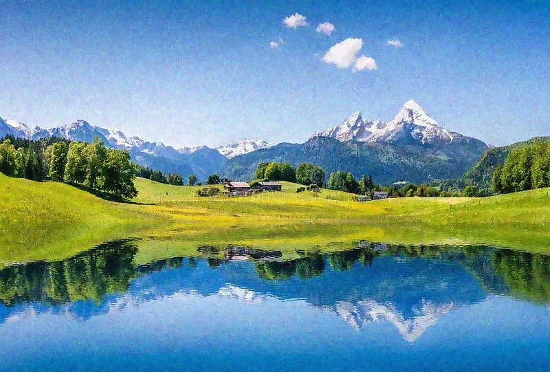
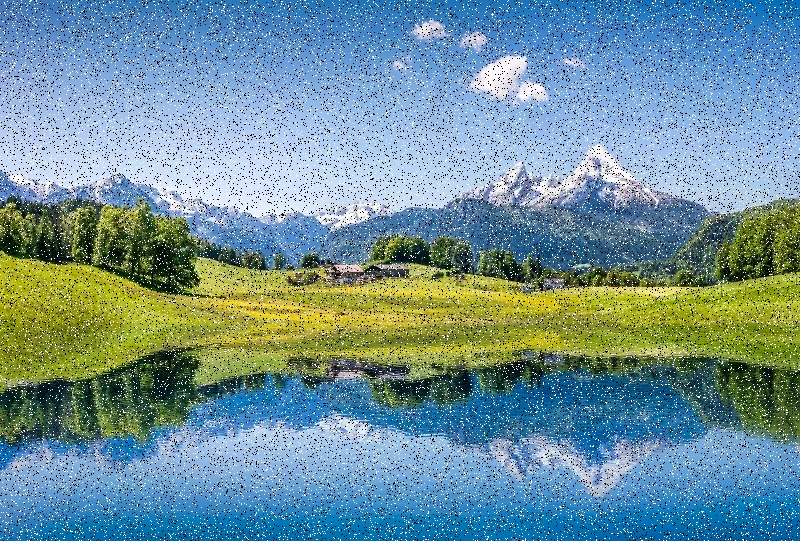
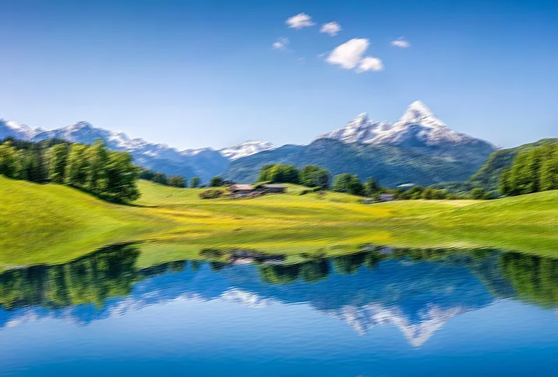
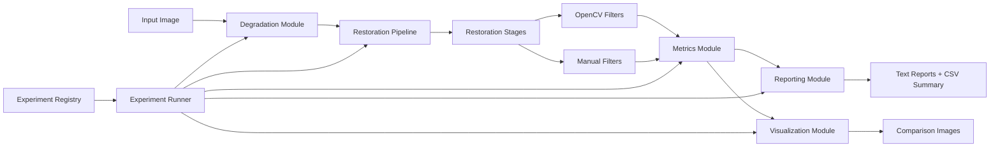

# Adaptive Image Restoration and Evaluation Framework (C++ / OpenCV)

## Overview

This project implements a **modular image restoration framework** that simulates real-world image degradations and evaluates restoration pipelines under controlled conditions.

The system enables systematic analysis of how different filtering strategies behave depending on the type of degradation, using both **numerical** and **perceptual** quality metrics.

The goal is not only to restore images, but to understand **why certain methods work better under specific conditions**, similar to challenges in real imaging pipelines.

---

## Visual Results

The framework generates side-by-side restoration outputs for each experiment. The examples below show the original image, the simulated degradation, and the final restored result.

### Pipeline A2 — Gaussian Noise Restoration

| Original | Degraded | Restored |
|---|---|---|
|  |  |  |

**Observation:** Gaussian noise is reduced while preserving much of the visible structure. Some smoothing is expected because denoising trades fine detail for noise suppression.

### Pipeline B3 — Salt-and-Pepper Noise Restoration

| Original | Degraded | Restored |
|---|---|---|
|  |  |  |

**Observation:** Median filtering is especially effective for impulse noise because it removes extreme black/white outlier pixels without averaging them into neighboring regions.

### Pipeline E1 — Motion Blur Restoration

| Original | Degraded | Restored |
|---|---|---|
|  |  |  |

**Observation:** Sharpening improves edge contrast, but simple spatial filters cannot fully recover information lost through directional motion blur.

## Key Features

- Modular pipeline architecture (degradation → restoration → evaluation)
- Multiple degradation models:
  - Gaussian noise
  - Salt-and-pepper noise
  - Low contrast + noise
  - Motion blur
- Multiple restoration techniques:
  - Gaussian filtering
  - Median filtering
  - Bilateral filtering
  - CLAHE (contrast enhancement)
  - Unsharp masking
  - Laplacian sharpening
- Manual implementations of core filters:
  - Gaussian blur
  - Median filter
- Quantitative evaluation:
  - MSE (Mean Squared Error)
  - PSNR (Peak Signal-to-Noise Ratio)
  - SSIM (Structural Similarity Index)
- Automated experiment execution and reporting
- CSV export for structured benchmarking

---

## Architecture

The project is structured as a reusable experimental framework:

- **experiment_registry** → defines all experiment configurations  
- **experiment_runner** → executes pipelines and collects results  
- **pipeline** → applies degradation and restoration stages  
- **metrics** → computes MSE, PSNR, SSIM  
- **manual_filters** → custom implementations of filters  
- **reporting** → generates reports and CSV summaries  
- **visualization** → creates comparison outputs  



The experiment runner coordinates configured experiments from the registry, applies degradations and restoration stages, evaluates image quality, and produces reports and visual outputs.

See [`docs/architecture.md`](docs/architecture.md) for detailed design.

---

## Example Pipelines

### Gaussian Noise Restoration
Gaussian noise → Bilateral filter → Unsharp mask

### Salt-and-Pepper Noise Restoration
Salt & pepper noise → Median filter → Unsharp mask

### Low Contrast Enhancement
Contrast reduction + noise → Bilateral filter → CLAHE

### Motion Blur Case
Motion blur → Sharpening (demonstrates limitations of naive restoration)

---

## Results & Key Insights

The framework reveals several important behaviors:

- Median filtering significantly outperforms Gaussian filtering for impulse noise  
- Bilateral filtering preserves edges better than standard smoothing  
- CLAHE improves contrast but does not fully recover heavily degraded images  
- Sharpening alone is ineffective for motion blur and may degrade quality  
- Improvements in PSNR do not always correspond to perceptual improvements (SSIM)  

Detailed analysis is available in [`docs/results.md`](docs/results.md).

---

## Manual vs OpenCV Comparison

Manual implementations of Gaussian and median filters were developed and compared against OpenCV equivalents.

The goal of the manual implementations is educational and analytical: they show how the algorithms work internally and allow direct comparison against optimized library implementations.

### Quality and Runtime Comparison

| Filter | Implementation | Final PSNR | Final SSIM | Avg. Runtime |
|---|---|---:|---:|---:|
| Gaussian | OpenCV | 25.9135 dB | 0.6394 | 0.3411 ms |
| Gaussian | Manual optimized | 25.9085 dB | 0.6398 | 113.7217 ms |
| Median | OpenCV | 25.8633 dB | 0.7152 | 2.5209 ms |
| Median | Manual | 25.8739 dB | 0.7151 | 2228.4269 ms |

The manual implementations produce nearly identical PSNR/SSIM values compared with OpenCV, but OpenCV is dramatically faster. This demonstrates the difference between algorithmic correctness and production-grade optimized image processing.

### Key Findings

- The optimized manual Gaussian preserves the same output quality metrics while improving the implementation structure.
- OpenCV remains orders of magnitude faster because it uses low-level optimizations such as SIMD/vectorization, cache-friendly memory access, and highly tuned kernels.
- Manual median filtering is useful for understanding the algorithm but is not suitable for real-time use in its current form.
- These results demonstrate the gap between correct algorithm implementation and production-grade optimized image processing.

---

## Build Instructions

```bash
mkdir build
cd build
cmake ..
make -j
```